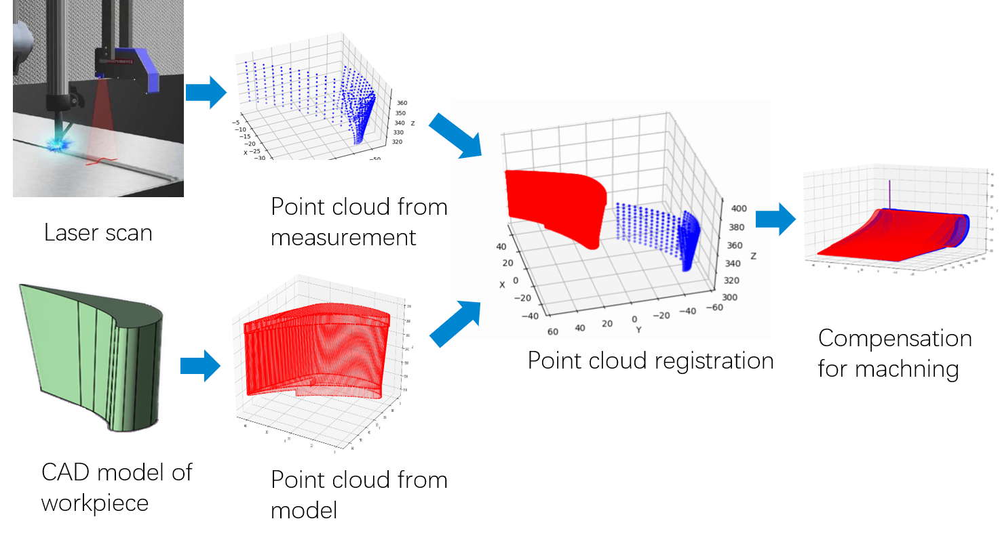

 The process of air film holes of aircraft engine turbine blade has a high rejection rate due to the error in the position and posture of workpiece. In this research, we acquire point cloud data using laser displacement sensor, then use matching algorithm to calculate the position and posture of the blade, and finally make adjustments accordingly during the processing. 

## Background
 When fixed by fixtures, there is always positioning and posturing error between the workpiece and fixtures, about several milimeters or degrees. Although tiny, this error can be fatal when machining air holes on aero-engine turbine blades, considering thousands of holes need to be made on an area of several square centimeters. Factory No.170 in Guiyang, Guizhou Province has undertaken over 70% of the production of military turbine blades in China. Previously, workers in this factory had to make adjustment by manual observation to make sure the blade is at the correct position and posture. In this way, precise adjustments are difficult to be made, which brings a high reject rate in hole-making process. Considering each blade worths thousands of dollars, this accounts for a great part of the cost in producing.
 

Prof. Wansheng Zhao in State Key Laboratory of Mechanical System and Vibration, Institute of Manufacturing Technology and Equipment Automation, Shanghai Jiao Tong University has led a team to build an automated, high-precision system to help No.170 factory reduce the reject rate in film hols making process. And I participated in this project under his instruction. My contribution was mainly on point cloud registration and calibration of laser displacement sensor. 

## Brief introduction to technical route

## My contribution
I write code for Iteration Closet Point (ICP) algorithm to calculate the homogeneous transform matrix between two sets of point clouds, which are generated by scanning the turbine blades using laser displacement sensor and extracted from the CAD model of blades, respectly. First, I tested the algorithm using MATLAB, then I wrote the code in python.

I also used a data structure called KD-tree to optimize the searching process.

